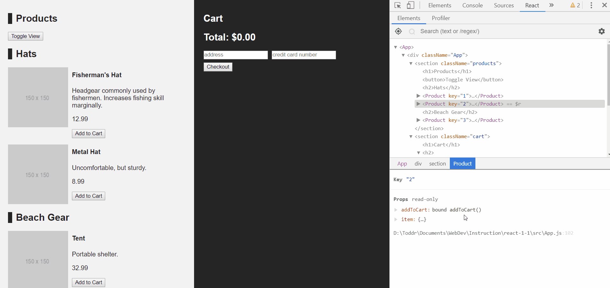
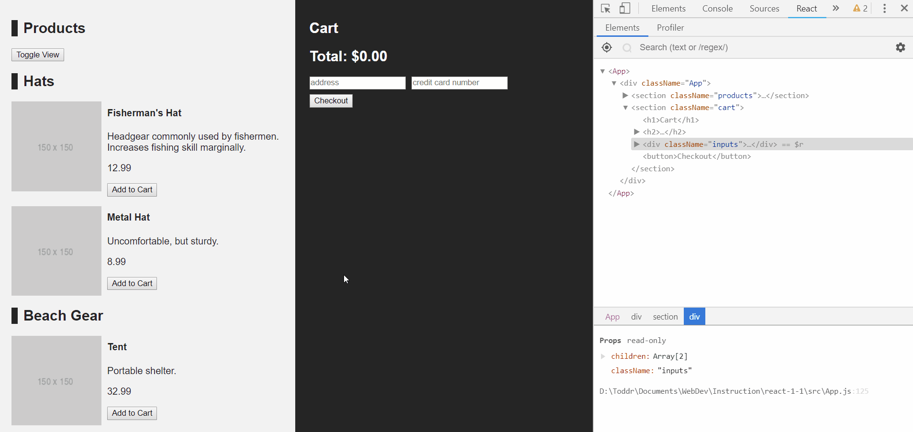
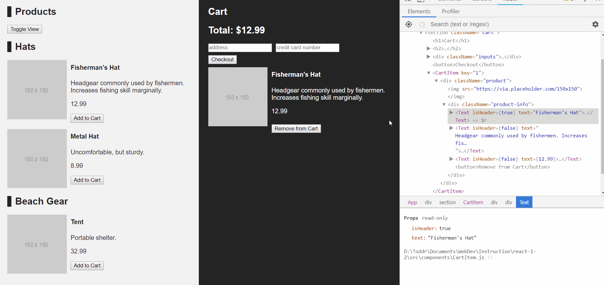

# Day 2

### Day 1 Continuation

For this project, we will be using the same project from the previous day
lecture, and we will be refactoring our code to take advantage of some of the
tools that React has to offer. If you want to use your previous project you can
do so and just follow the readme on this page (no need to clone this repo), but
it is expected that you finished parts 1 and 2 of Day 1. If you didn't get that
far or just want to start fresh we have provided code that will put you at the
correct starting point, just follow the instructions below for cloning the
project.

In this project we will be using reusable `functional components` to follow the
DRY principle, which is, don't repeat yourself. We will pass `props` into our
reusable `components`. At the end of this project, you should have a better
understanding of the following concepts:

- Props
- PropTypes
- Functional Components
- Reusable Components

## Live Example

# Cloning (Optional)

- `Fork` this repository.
- `clone` this repo onto your computer.
- `cd` into this repository and run `npm i`.
- if you did that successfully you will see a `node_modules` folder in the same
  directory as the `src` and `public` folder.

# Part 1

### Summary

In this part we will create two functional components so that we don't have to
repeat our `JSX` for a `product` in the `products section` and `cart section`.
We'll make use of `props` to pass in a `product` to `render`.

## Step 1

- Create a `components` folder inside the `src` folder.

## Step 2

- Create `Product.js` inside the `src/components` folder.
- inside the `Product.js` file make a functional component with same name as the
  file.
- Use the values off of the `props` object passed into the function to render a
  product.
  - All the properties about the product will be on props.item.`property`, it
    may be a good idea to destructure those values.
  - (At this moment we are not passing down props but we will in the next step):
    - Use an `img` element for the product's `imageUrl`.
    - Use a `h4` element for the product's `title`.
    - Use a `p` element for the product's `description`.
    - Use a `p` element for the product's `price`.
    - Use a `button` element that says "Add to Cart":
      - Add an `onClick` handler that calls `addToCart` off of `props`.
      - Remember to pass in the product as an `argument`.

_The `JSX` for `src/components/Product.js` is almost identical to the map in
`src/App.js`_

<details>

<summary> Detailed Instructions </summary>
<br />

Let's begin by creating a new file called `Product.js` inside of the
`src/components` folder and create a `functional component` called `Product`
inside of it. Make sure it includes props in its parameters.

```js
import React from 'react';

export default function Product(props) {}
```

Now that we have our `functional component` we are going to make some
assumptions here. This `component` should expect to receive two `props`. One
`prop` called `item` which will be a `product object` and another `prop` called
`addToCart` which will be the `addToCart method` from `src/App.js`. With these
assumptions, let's start by destructuring them off of the `props` argument.

```js
import React from 'react';

export default function Product(props) {
  const { item, addToCart } = props;
}
```

With those assumptions out of the way, the `JSX` we need is almost exactly the
same as the `JSX` we are already using in `src/App.js`. Let's move that `JSX`
over into the `component` to start.

```js
import React from 'react';

export default function Product(props) {
  const { item, addToCart } = props;

  return (
    <div key={item.id} className="product">
      
      <div className="product-info">
        <h4>{item.title}</h4>
        <p>{item.description}</p>
        <p>{item.price}</p>
        <button onClick={() => this.addToCart(item)}>Add to Cart</button>
      </div>
    </div>
  );
}
```

Now we can start taking away the pieces of code that don't make sense in this
file. For starters, we no longer need a `key` on our most parent `div` because
we aren't executing a map inside of `src/components/Product.js`. We can also
strip away the `this` from `this.addToCart(item)` since that method is now being
passed down as a prop.

```js
import React from 'react';

export default function Product(props) {
  const { item, addToCart } = props;

  return (
    <div class="product">
      
      <div className="product-info">
        <h4>{item.title}</h4>
        <p>{item.description}</p>
        <p>{item.price}</p>
        <button onClick={() => addToCart(item)}>Add to Cart</button>
      </div>
    </div>
  );
}
```

</details>

### Solution

<details>

<summary> <code> src/components/Product.js </code> </summary>
<br />

```js
import React from 'react';

export default function Product(props) {
  const { item, addToCart } = props;

  return (
    <div class="product">
      
      <div className="product-info">
        <h4>{item.title}</h4>
        <p>{item.description}</p>
        <p>{item.price}</p>
        <button onClick={() => addToCart(item)}>Add to Cart</button>
      </div>
    </div>
  );
}
```

</details>

## Step 3

- Open `src/App.js`.
- Import the `Product` component.
- Scroll down to the `products section`:
  - Replace the current map's `JSX` with rendering a `Product component`.
  - Remember to pass down an `item` and `addToCart prop`.
- Bind the correct context of `this` to `addToCart` in `src/App.js`.

<details>

<summary> Detailed Instructions </summary>

<br />

Let's begin by opening `src/App.js` and `import` the `Product` component.

```js
import React, { Component } from "react";
import Product from "./components/Product";
import "./App.css";

export default class App extends Component {
...
```

Now that we have access to the `Product` component, we can replace the `JSX` in
the `map` for our `products section`. Remember that the `Product` component is
expecting an `item` and `addToCart prop`. Also, we will still need to use a
`key prop` here since we are inside a map.

```js
<section className="products">
  <h1>Products</h1>
  <h2>Hats</h2>
  {this.state.hats.map(item => (
    <Product key={item.id} item={item} addToCart={this.addToCart} />
  ))}

  <h2>Beach Gear</h2>
  {this.state.beachGear.map(item => (
    <Product key={item.id} item={item} addToCart={this.addToCart} />
  ))}
</section>
```

Lastly, we'll need to fix the context of `this` for the `addToCart` method. We
can either bind it in the `constructor method`, use an `arrow function`, or turn
the `addToCart` method into an `arrow function`.

```js
addToCart = item => {
  this.setState({
    cart: [...this.state.cart, item],
  });
};
```

</details>

### Solution

<details>

<summary> <code> src/App.js </code> </summary>
<br />

```js
import React, { Component } from 'react';
import Product from './components/Product';
import './App.css';

export default class App extends Component {
  constructor() {
    super();
    this.state = {
      cart: [],
      hats: [
        {
          id: 1,
          title: "Fisherman's Hat",
          description:
            'Headgear commonly used by fishermen. Increases fishing skill marginally.',
          price: 12.99,
          imageUrl: 'https://via.placeholder.com/150x150',
        },
        {
          id: 2,
          title: 'Metal Hat',
          description: 'Uncomfortable, but sturdy.',
          price: 8.99,
          imageUrl: 'https://via.placeholder.com/150x150',
        },
      ],
      beachGear: [
        {
          id: 3,
          title: 'Tent',
          description: 'Portable shelter.',
          price: 32.99,
          imageUrl: 'https://via.placeholder.com/150x150',
        },
      ],
    };
  }

  addToCart = item => {
    this.setState({
      cart: [...this.state.cart, item],
    });
  };

  checkout = () => {
    this.setState({ cart: [] });
    alert('Purchase is complete!');
  };

  render() {
    return (
      <div className="App">
        <section className="products">
          <h1>Products</h1>
          <h2>Hats</h2>
          {this.state.hats.map(item => (
            <Product key={item.id} item={item} addToCart={this.addToCart} />
          ))}

          <h2>Beach Gear</h2>
          {this.state.beachGear.map(item => (
            <Product key={item.id} item={item} addToCart={this.addToCart} />
          ))}
        </section>

        <section className="cart">
          <h1>Cart</h1>
          <h2>
            Total: $
            {this.state.cart.reduce(
              (totalPrice, product) => (totalPrice += product.price),
              0
            )}
          </h2>
          <button onClick={this.checkout}>Checkout</button>
          {this.state.cart.map(item => (
            <div key={item.id} className="product">
              
              <div className="product-info">
                <h4>{item.title}</h4>
                <p>{item.description}</p>
                <p>{item.price}</p>
              </div>
            </div>
          ))}
        </section>
      </div>
    );
  }
}
```

</details>

<br>



## Step 4

- Use the values off of the `props` object passed into the function to render a
  product.

  - All the properties about the product will be on props.item.`property`, it
    may be a good idea to destructure those values.
  - (At this moment we are not passing down props but we will in the next step):

- Create `CartItem.js` inside the `src/components` folder.
- inside the `CartItem.js` file make a functional component with same name as
  the file.
- Use the values off of the `props` object passed into the function to render a
  product.
  - All the properties about the product will be on props.item.`property`, it
    may be a good idea to destructure those values.
  - (At this moment we are not passing down props but we will in the next step):
    - Use an `img` element for the `product`'s `imageUrl`.
    - Use a `h4` element for the `product`'s `title`.
    - Use a `p` element for the `product`'s `description`.
    - Use a `p` element for the `product`'s `price`.
- Open `src/App.js`.
- Import the `CartItem component`.
- Scroll down to the `cart section`:
  - Replace the current map's `JSX` with rendering a `CartItem component`.
  - Remember to pass down an `item prop`.

<details>

<summary> Detailed Instructions </summary>

<br />

Let's begin by creating a new file called `CartItem.js` inside of the
`src/components` folder and create a `functional component` called `CartItem`
inside of it.

```js
import React from 'react';

export default function CartItem(props) {}
```

Just like we did earlier, we'll destructure `item` off of `props` and then
`render` the `JSX` from the `cart section`'s map in `src/App.js`. We'll then
strip away the `key prop` since we are not mapping inside of `CartItem`.

```js
import React from 'react';

export default function Product(props) {
  const { item } = props;

  return (
    <div class="product">
      
      <div className="product-info">
        <h4>{item.title}</h4>
        <p>{item.description}</p>
        <p>{item.price}</p>
      </div>
    </div>
  );
}
```

Now that our `CartItem` component is ready, let's open `src/App.js` and `import`
it.

```js
import React, { Component } from "react";
import Product from "./components/Product";
import CartItem from "./components/CartItem";
import "./App.css";

export default class App extends Component {
...
```

Now that we have access to the `CartItem` component, we can replace the `JSX` in
the `map` for our `cart section`. Remember that the `CartItem component` is
expecting an `item prop`. Also, we will still need to use a `key prop` here
since we are inside a map.

```js
<section className="cart">
  <h1>Cart</h1>
  <h2>
    Total: $
    {this.state.cart.reduce(
      (totalPrice, product) => (totalPrice += product.price),
      0
    )}
  </h2>
  <button onClick={this.checkout}>Checkout</button>

  {this.state.cart.map(item => (
    <CartItem key={item.id} item={item} />
  ))}
</section>
```

</details>

### Solution

<details>

<summary> <code> src/CartItem.js </code> </summary>

```js
import React from 'react';

export default function CartItem(props) {
  const { item } = props;

  return (
    <div class="product">
      
      <div className="product-info">
        <h4>{item.title}</h4>
        <p>{item.description}</p>
        <p>{item.price}</p>
      </div>
    </div>
  );
}
```

</details>

<details>

<summary> <code> src/App.js </code> </summary>

```js
import React, { Component } from 'react';
import Product from './components/Product';
import CartItem from './components/CartItem';
import './App.css';

export default class App extends Component {
  constructor() {
    super();
    this.state = {
      cart: [],
      hats: [
        {
          id: 1,
          title: "Fisherman's Hat",
          description:
            'Headgear commonly used by fishermen. Increases fishing skill marginally.',
          price: 12.99,
          imageUrl: 'https://via.placeholder.com/150x150',
        },
        {
          id: 2,
          title: 'Metal Hat',
          description: 'Uncomfortable, but sturdy.',
          price: 8.99,
          imageUrl: 'https://via.placeholder.com/150x150',
        },
      ],
      beachGear: [
        {
          id: 3,
          title: 'Tent',
          description: 'Portable shelter.',
          price: 32.99,
          imageUrl: 'https://via.placeholder.com/150x150',
        },
      ],
    };
  }

  addToCart = item => {
    this.setState({
      cart: [...this.state.cart, item],
    });
  };

  checkout = () => {
    this.setState({ cart: [] });
    alert('Purchase is complete!');
  };

  render() {
    return (
      <div className="App">
        <section className="products">
          <h1>Products</h1>
          <h2>Hats</h2>
          {this.state.hats.map(item => (
            <Product key={item.id} item={item} addToCart={this.addToCart} />
          ))}

          <h2>Beach Gear</h2>
          {this.state.beachGear.map(item => (
            <Product key={item.id} item={item} addToCart={this.addToCart} />
          ))}
        </section>

        <section className="cart">
          <h1>Cart</h1>
          <h2>
            Total: $
            {this.state.cart.reduce(
              (totalPrice, product) => (totalPrice += product.price),
              0
            )}
          </h2>
          <button onClick={this.checkout}>Checkout</button>

          {this.state.cart.map(item => (
            <CartItem key={item.id} item={item} />
          ))}
        </section>
      </div>
    );
  }
}
```

</details>

<br>



# Part 2

### Summary

In this part we will start using the `prop-types` library to provide better
documentation and an enhanced debugging experience to the `CartItem` and
`Product` components. We will also create a new `Text` component that will
replace our our `<h4>` and `<p>` tags based off of the `props` that it receives.

## Step 1

- Install the `prop-types` library by running `npm install prop-types`.

## Step 2

- Open `src/components/Product.js`.
- import the `prop-types` library.
- Define the component `propTypes` after the ending curly brace of the
  functional component definition.
- Provide the appropriate propTypes for the `item` prop being passed into the
  `Product` component.

<details>

<summary>Detailed Instructions</summary>
<br />

Lets begin by opening `src/components/Product.js` and importing `prop-types` at
the top of the file.

```js
import React from 'react';
import PropTypes from 'prop-types';
```

We will then scroll to the bottom of the file and define the `propTypes` object
for this component after the closing curly brace of the functional component.
This component is receiving two props: `item` which is an `Object` that has
multiple product properties on it, and `addToCart` which is a function. We can
specify the required properties for the item object using the `PropTypes.shape`
method and defining each required property of the `item` object and the
corresponding data type for each of those properties. Each `item` has the
following properties with their associated data type: id-`Number`,
title-`String`, description-`String`, price-`Number`, imageUrl-`String`. Then we
want to add the addToCart function, it too is required. We can mark each
property on the object as required so that we will be warned if any of those
properties are missing.

```js
Product.propTypes = {
  item: PropTypes.shape({
    id: PropTypes.number.isRequired,
    title: PropTypes.string.isRequired,
    description: PropTypes.string.isRequired,
    price: PropTypes.number.isRequired,
    imageUrl: PropTypes.string.isRequired,
  }),
  addToCart: PropTypes.func.isRequired,
};
```

</details>

## Step 3

- Open `src/components/CartItem.js`.
- import the `prop-types` library.
- Define the component `propTypes` after the ending curly brace of the
  functional component definition.
- Provide the appropriate propTypes for the `item` prop being passed into the
  `CartItem` component.

<details>

<summary>Detailed Instructions</summary>
<br />

Now we will basically repeat the process of defining the `propTypes` in the
`Product` component in the `CartItem` component. Lets begin by opening
`src/CartItem.js` and importing `prop-types` at the top of the file.

```js
import React from 'react';
import PropTypes from 'prop-types';
```

We will then scroll to the bottom of the file and define the `propTypes` object
for this component after the closing curly brace of the functional component.
This component is receiving a single prop: `item` which is an `Object` that has
multiple product properties on it. We can specify the required properties for
this object using the `PropTypes.shape` method and defining each required
property of the `item` object and the corresponding data type for each of those
properties. Since the items in the cart have the same data as the list of
available products, the `propTypes` for this component will look almost
identical to the `Product` component. Each `item` has the following properties
with their associated data type: id-`Number`, title-`String`,
description-`String`, price-`Number`, imageUrl-`String`. We can mark each
property on the object as required so that we will be warned if any of those
properties are missing.

```js
CartItem.propTypes = {
  item: PropTypes.shape({
    id: PropTypes.number.isRequired,
    title: PropTypes.string.isRequired,
    description: PropTypes.string.isRequired,
    price: PropTypes.number.isRequired,
    imageUrl: PropTypes.string.isRequired,
  }),
};
```

</details>

## Step 4

- Create a new `Text` `functional component` in `src/components`.
- The `Text` component should receive two `props`.
  - `isHeader` - A boolean based off of whether the text is a header or not.
  - `text` - The string value of the text to be rendered.
- Add the appropriate `propTypes` to the `Text` component.
- Replace all instances of `h4` and `p` tags with our new text component with
  the appropriate `props`.

<details>

<summary>Detailed Instructions</summary>
<br />

Lets start by creating a new `Text.js` file inside of our `src/components`
folder. Create a `functional component` inside our newly created file. This
`Text` component should receive two `props`: `isHeader`(boolean) and
`text`(string or number). We can then destructure those props after the function
declaration as a clean way to use those props as variables.

```js
import React from 'react';

export default function Text(props) {
  const { text, isHeader } = props;
}
```

We can then add some logic to render either an `h4` or a `p` tag based off of
the value of the `isHeader` prop passed in. A great way to do this is by using
the ternary operator to determine which `JSX` to render. We can add the return
statement right next to the ternary so that the component renders the resulting
value from the ternary.

```js
import React from 'react';
import propTypes from 'prop-types';

export default function Text(props) {
  const { text, isHeader } = props;
  return isHeader ? <h4>{text}</h4> : <p>{text}</p>;
}
```

Since this component is receiving `props`, we should add `propTypes` to improve
the documentation and debugging experience of this component. As a reminder,
this component is receiving two props: `isHeader`(boolean), and `text`(string).
Both props are required. Dont forget to import the `prop-types` library. Since
the `text` prop could be a string in the case of a title or description, or a
number in the case of a price, we will need to use the `PropTypes.oneOfType`
method. This method takes an array of acceptable `propTypes` for that specific
prop.

```js
import React from 'react';
import PropTypes from 'prop-types';

export default function Text(props) {
  const { text, isHeader } = props;
  return isHeader ? <h4>{text}</h4> : <p>{text}</p>;
}

Text.propTypes = {
  text: PropTypes.oneOfType([
    PropTypes.string.isRequired,
    PropTypes.number.isRequired,
  ]),
  isHeader: PropTypes.bool.isRequired,
};
```

We can now use our new `Text` component inside the `CartItem` and `Product`
components. Open `src/components/CartItem.js`, import the `Text` component after
the other import.

```js
import React from 'react';
import Text from './Text';
```

We can now replace any `h4` or `p` tag with our newly imported `Text` component.
For any `h4` tag, we want to set the `isHeader` prop to true, otherwise we want
the `isHeader` prop to be set to false. We also want to set the information in
between the `h4` or `p` tags to the `text` prop.

```js
import React from 'react';
import Text from './Text';
import PropTypes from 'prop-types';

export default function CartItem(props) {
  const { item } = props;

  return (
    <div className="product">
      
      <div className="product-info">
        <Text isHeader={true} text={item.title} />
        <Text isHeader={false} text={item.description} />
        <Text isHeader={false} text={item.price} />
      </div>
    </div>
  );
}

CartItem.propTypes = {
  item: PropTypes.shape({
    id: PropTypes.number.isRequired,
    title: PropTypes.string.isRequired,
    description: PropTypes.string.isRequired,
    price: PropTypes.number.isRequired,
    imageUrl: PropTypes.string.isRequired,
  }),
};
```

We will now repeat this process in the `Product` component.

```js
import React from 'react';
import PropTypes from 'prop-types';
import Text from './Text';

export default function Product(props) {
  const { item, addToCart } = props;

  return (
    <div className="product">
      
      <div className="product-info">
        <Text isHeader={true} text={item.title} />
        <Text isHeader={false} text={item.description} />
        <Text isHeader={false} text={item.price} />
        <button onClick={() => addToCart(item)}>Add to Cart</button>
      </div>
    </div>
  );
}

Product.propTypes = {
  item: PropTypes.shape({
    id: PropTypes.number.isRequired,
    title: PropTypes.string.isRequired,
    description: PropTypes.string.isRequired,
    price: PropTypes.number.isRequired,
    imageUrl: PropTypes.string.isRequired,
  }),
  addToCart: PropTypes.func.isRequired,
};
```

</details>

### Solution

<details>

<summary> <code> src/components/Product.js </code> </summary>
<br />

```js
import React from 'react';
import PropTypes from 'prop-types';
import Text from './Text';

export default function Product(props) {
  const { item, addToCart } = props;

  return (
    <div className="product">
      
      <div className="product-info">
        <Text isHeader={true} text={item.title} />
        <Text isHeader={false} text={item.description} />
        <Text isHeader={false} text={item.price} />
        <button onClick={() => addToCart(item)}>Add to Cart</button>
      </div>
    </div>
  );
}

Product.propTypes = {
  item: PropTypes.shape({
    id: PropTypes.number.isRequired,
    title: PropTypes.string.isRequired,
    description: PropTypes.string.isRequired,
    price: PropTypes.number.isRequired,
    imageUrl: PropTypes.string.isRequired,
  }),
  addToCart: PropTypes.func.isRequired,
};
```

</details>

<details>
<summary> <code> src/components/CartItem.js </code> </summary>

```js
import React from 'react';
import Text from './Text';
import PropTypes from 'prop-types';

export default function CartItem(props) {
  const { item } = props;

  return (
    <div className="product">
      
      <div className="product-info">
        <Text isHeader={true} text={item.title} />
        <Text isHeader={false} text={item.description} />
        <Text isHeader={false} text={item.price} />
      </div>
    </div>
  );
}

CartItem.propTypes = {
  item: PropTypes.shape({
    id: PropTypes.number.isRequired,
    title: PropTypes.string.isRequired,
    description: PropTypes.string.isRequired,
    price: PropTypes.number.isRequired,
    imageUrl: PropTypes.string.isRequired,
  }),
};
```

</details>

<details>
<summary> <code> src/components/Text.js </code> </summary>

```js
import React from 'react';
import PropTypes from 'prop-types';

export default function Text(props) {
  const { text, isHeader } = props;
  return isHeader ? <h4>{text}</h4> : <p>{text}</p>;
}

Text.propTypes = {
  text: PropTypes.oneOfType([
    PropTypes.string.isRequired,
    PropTypes.number.isRequired,
  ]),
  isHeader: PropTypes.bool.isRequired,
};
```

</details>

<br>



# Part 3 - Black Diamond

### Summary

In this part we will add in the remove from cart function to the `CartItem`
component. We will also need to add onto the prop types object to account for
this. We will also add in the functionality to change the view of each card.

## Step 1

- Open `src/App.js`.
- If you have not already then you will need to create a method on `App.js`
  called `deleteFromCart`.
- This Method will take in an ID of the item you want to remove from the cart.
- Have it remove the item from state then `setState` with the new array.
- Because we are moving this method to another component make sure you bind it.
- Then pass it down as a prop to the `CartItem` component.

## Step 2

- Open `src/components/CartItem`.
- Add a button that says `remove from cart` that when clicked runs the
  deleteFromCart prop.
- Also make sure to add it to your propType object at the bottom of the file.

## Step 3

- Open `src/App.js`.
- If you have not already then you will need to create a method on `App.js`
  called `handleToggleView`.
  - this function will change the way the product cards are displayed by
    toggling a boolean on state.
- then you will need to pass that value down as a prop into each `Product`
  component.
- on one of the divs inside the `Product.js` you will need to turn the
  `className` into a ternary.
  - have it toggle between two different class names to based on the value
    passed down by props.
- Don't forget to also add the new prop to the `Prop.Types`

# Part 4 - Black Diamond

### Summary

In this part we will add a search bar which can filter the list of products. We
will also add a navbar at the top of the app that can toggle between product and
cart view.

## Step 1

- Open `src/App.js`
- In the products section under the header in App.js, create an input that will
  be our search bar.
  - Store its value on state.
  - Create an `onChange` event listener that will update state with the user
    input.

## Step 2

- Change the code where we map over products to display so that we are filtering
  based on the user input string if the user has typed anything.

## Step 3

- Add a navbar with a button at the top of the `src/App.js`.
- The user should be able to toggle between Product View and Cart View, by
  changing a boolean value on state.
- Use conditional rendering (with the ternary operator), so that only one view
  is displayed at a time.
